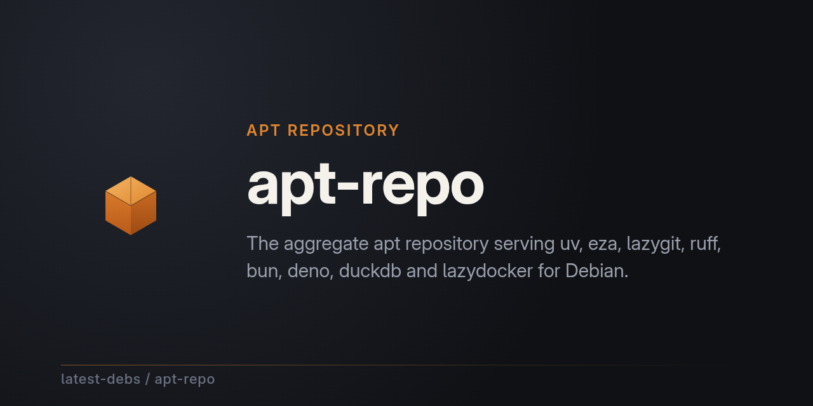

# latest-debs apt repository

Latest stable releases of developer tools, packaged for Debian and Ubuntu and
served over `apt`.

- **Debian:** Bullseye (11), Bookworm (12), Trixie (13), Forky (14/testing), Sid (unstable)
- **Ubuntu:** Jammy (22.04 LTS), Noble (24.04 LTS), Questing (25.10), Resolute
  (26.04 LTS) — all served as aliases of a Debian suite with older-or-equal
  glibc (Jammy from Bullseye; Noble/Questing/Resolute from Trixie), so no
  separate Ubuntu build is needed (see `suites.json`'s `aliases` map)
- **Architectures:** amd64, arm64, armhf, ppc64el, s390x, riscv64, loong64 (plus i386 and armel on bullseye/bookworm/trixie)
- **Updates:** near-instant — publishing a release in a `*-debian` repo
  triggers an immediate rebuild via webhook, with a ~6h scheduled run as the
  fallback. Best-effort, no SLA (see
  [Support & expectations](#support--expectations-best-effort-no-sla))

All packages are built from upstream releases using the
[debian-multiarch-builder](https://github.com/ranjithrajv/debian-multiarch-builder)
GitHub Action. Each tool's packaging lives in its own repo under this
organization.

Every release is gated by **lintian** (Debian's package policy checker) and a
**smoke test** that runs the packaged binaries in a container and verifies
they report the expected version before the release is published — so the
channel only ever carries packages that both pass policy and actually run.

## Why this channel exists

An **auditable, signed, test-gated latest channel** — that's the differentiator.
It sits between two unsatisfying extremes: Debian's frozen cadence and ad-hoc
"download the tarball from GitHub" installs.

**vs. Debian stable** — Debian freezes versions for years; you wait for
backports or the next release. Here, the moment a `*-debian` repo publishes a
release, a webhook (`repository_dispatch`) fires an **immediate** apt-repo
rebuild — with a ~6h scheduled run as the catch-up backstop — so you get
current tools on a stable base, through the same `apt` you already trust.

**vs. Debian itself** — when a live Debian suite (most often sid/unstable,
but sometimes trixie too — common for tools with a Debian Developer
upstream, e.g. `bat`, `fd`) already tracks a tool's latest upstream release,
it's already offering exactly what this channel would add, on a much larger
base of packages. We don't duplicate that — see
[Debian parity](#debian-parity--when-we-step-aside) below.

**vs. ad-hoc release downloads** — a raw GitHub binary is trust-on-download:
no policy check, no run test, no signature chain, no record of what you got.
Every package in this channel instead carries:

- **Signed** — the apt indexes are GPG-signed on every rebuild
  (`scripts/sign-repo.sh`) and `apt` verifies them via `signed-by=`, so the
  metadata describing every package is authentic, not just the download.
- **Test-gated** — lintian (Debian's packaging policy checker) plus a smoke
  test that actually runs the packaged binaries in a container and confirms
  they report the expected version. Nothing is released that fails policy or
  doesn't run.
- **Auditable** — each package carries a provenance pin (upstream release
  identity + SHA-256, cross-checked against the vendor's published checksum at
  vet time), every build lands as a *draft* that a maintainer reviews before
  promotion, and the whole chain — packaging repos, builder action, rebuild
  pipeline — runs in public repos with full history (see
  [Supply chain & provenance](#supply-chain--provenance)).

That combination is what ad-hoc downloads can't offer (no signing, no policy,
no audit trail) and what Debian's cadence can't offer (currency).

**And we retire ourselves when Debian catches up.** Most third-party
repositories have a structural reason to keep you on them; this one does not.
When a tool reaches its latest upstream version in a released suite, we drop
our package — when it reaches parity in a rolling suite, we drop that suite
from our build and leave the rest. It is applied automatically by
`scripts/build-repo.sh` from a daily parity report, not left to good
intentions, and every hand-off is recorded in
[`graduated.json`](graduated.json) with where to go instead. The
[dashboard](https://latest-debs.github.io/status.html) counts suites handed
back as wins rather than to-do items. A vendor apt repo or a Homebrew tap has
no equivalent — nothing in either shrinks its own scope when the distribution
catches up. Full mechanics in
[Debian parity](#debian-parity--when-we-step-aside).

## For project maintainers: package your tool as a signed `.deb`

Have a project that publishes a Linux binary on GitHub? We can package it for
Debian the same way the tools above are — signed, test-gated, provenance-pinned,
and kept current automatically. The `<tool>-debian` repo is yours: public,
forkable, and maintained via the feature channel (a template change rolls out
to every package repo in one operation, so improvements land everywhere at
once).

What you get, concretely:

- A public packaging repo scaffolded from one template, with CI and full history.
- Auto-watch: new upstream releases are built automatically, no per-version work.
- All five Debian suites × every architecture your release actually publishes
  a Linux binary for (verified precisely at vet time), plus source packages.
  A suite drops out automatically once its Debian LTS window ends.
- GPG-signed apt indexes, lintian + smoke-test gates, a vet-time SHA-256
  provenance pin, and automated license/SPDX + asset pre-checks at intake.
- Near-instant updates via webhook-triggered rebuilds.

It's volunteer-run and best-effort (no SLA), but the packaging is yours to
fork and take anywhere. See **[SERVICE.md](SERVICE.md)** for the full pitch,
the offer, and how to get started (or just open a
[package request](https://github.com/latest-debs/apt-repo/issues/new?template=package-request.yml)).

## Support & expectations (best-effort, no SLA)

This is a volunteer-run project, not a commercial service. Everything runs on
free GitHub Actions and manual review, so treat the channel as **best-effort
with no SLA**:

- **Rebuild cadence.** Publishing a release normally rebuilds the apt index
  within minutes (a webhook from the `*-debian` repo triggers it). If that
  webhook is missed — lost dispatch, a missing `TRIGGER_TOKEN`, a runner
  outage, or GitHub deferring scheduled/dispatch events under load — the ~6h
  scheduled run is the guaranteed catch-up. A freshly published upstream
  release can therefore appear within minutes or take longer, and if an
  upstream archive becomes unavailable, that version may be skipped entirely.
  Don't build a pipeline that depends on a package appearing by a deadline.
- **Draft release promotion.** Packages are never auto-published. Every build
  lands as a *draft* GitHub release that a maintainer reviews and publishes by
  hand (see [Supply chain & provenance](#supply-chain--provenance)). That
  human gate is deliberate — it keeps tampered or broken releases out of the
  channel — but it means promotion lags the build, and if a maintainer is
  away, newer versions wait. `scripts/promote-drafts.sh` makes catching up a
  single reviewed command (list, then publish, across every `*-debian` repo).
- **Upstream dependency.** We repackage upstream GitHub releases as they
  publish them. If an upstream changes its release layout, removes old
  archives, or goes away, the corresponding tool stops updating until someone
  fixes the packaging. The [staleness watchdog](#upstream-staleness-watchdog)
  catches that automatically — a tool whose upstream release outlives the
  rebuild + promotion grace window lands on the
  [`stale-package`](https://github.com/latest-debs/apt-repo/labels/stale-package)
  tracking issue — but the fix itself still needs a human.

What we do guarantee: the channel stays internally consistent. Indexes are
always GPG-signed, every package is lintian-checked, smoke-tested, and
checksum-verified before publication, and nothing ships that a human hasn't
reviewed. Rely on it for convenience — not for security-critical or
time-critical patch delivery.

## Install

Via [extrepo](https://salsa.debian.org/extrepo-team/extrepo) (Debian, and
Ubuntu except 22.04):

```sh
sudo extrepo enable latest-debs
sudo apt update
sudo apt install uv eza lazygit
```

> [!IMPORTANT]
> **`extrepo enable latest-debs` is currently broken — use the manual snippet
> below instead.** The policy published in
> [extrepo-data](https://salsa.debian.org/extrepo-team/extrepo-data/-/blob/master/repos/debian/latest-debs.yaml)
> still carries the old `https://latest-debs.github.io/apt-repo/` base URI.
> That origin still serves `dists/`, so `apt update` succeeds and the packages
> appear — but `pool/` is no longer published there (it exceeded GitHub Pages'
> 1GB published-site limit), so every `apt install` 404s on download. The
> manual snippet below points at the redirector, which serves both. This
> clears once the extrepo-data MR in
> [`extrepo/latest-debs.yaml`](extrepo/latest-debs.yaml) is merged upstream.

> **On Ubuntu 22.04 (jammy), use the manual snippet below instead.** extrepo
> takes its suite from `/etc/extrepo/config.yaml` — a static file shipped in
> the package, not read from `os-release` — and jammy's extrepo 0.9 pins
> `bookworm`, whose glibc (2.36) is newer than jammy's (2.35). The manual
> snippet uses jammy's own codename, which we serve as an alias of bullseye
> (glibc 2.31). Noble and later pin `trixie`, the same alias target this
> repo already maps them to, so extrepo and the manual snippet install
> identical packages there.

Manually:

```sh
sudo install -d -m 0755 /etc/apt/keyrings
curl -fsSL https://raw.githubusercontent.com/latest-debs/apt-repo/main/latest-debs.asc | sudo gpg --dearmor --yes -o /etc/apt/keyrings/latest-debs.gpg
echo "deb [signed-by=/etc/apt/keyrings/latest-debs.gpg] https://latest-debs.ranjithraj.workers.dev/ $(lsb_release -sc) main" | sudo tee /etc/apt/sources.list.d/latest-debs.list
sudo apt update
```

> **Note:** The repository indexes are GPG-signed (`scripts/sign-repo.sh` runs
> automatically on every rebuild). `apt` verifies signatures against the key
> imported above via `signed-by=`.

## For CI pipelines & fleets

If you're installing these tools in a build image, a CI runner, or across a
fleet, the usual options are `curl | sh` inside the Dockerfile or a version
manager (`mise`, `asdf`) resolving a plugin at build time — neither gives you
a signature, a pinned checksum, or a record of what actually got installed.

This channel gives a CI/fleet pipeline something to point at instead:

- **Pin an exact version, and verify the pin cryptographically.** Every
  release carries a **Sigstore-signed SLSA build-provenance attestation** and
  a **signed SPDX SBOM**, both bound to the exact artifact bytes. That turns
  "trust our `provenance.json`" into something your pipeline can check itself,
  with no appeal to us:

  ```sh
  # Fails loudly if the .deb was not built by the workflow it claims.
  gh attestation verify uv_0.12.3-1+trixie_amd64.deb --repo latest-debs/uv-debian

  # Same artifact, its SPDX SBOM.
  gh attestation verify uv_0.12.3-1+trixie_amd64.deb --repo latest-debs/uv-debian \
    --predicate-type https://spdx.dev/Document
  ```

  Run it as a gate in the build that consumes the package, and a substituted
  or re-uploaded artifact fails the step instead of shipping. Alongside those,
  each release still carries the human-readable `provenance.json` (source
  commit, builder run URL, SHA-256 of every shipped artifact) and
  `sbom.spdx.json`, and was built against a vet-time upstream checksum pin.
  See [Supply chain & provenance](#supply-chain--provenance).

  **What the SBOM does and does not cover**, since an overstated SBOM is worse
  than none: it documents the shipped artifacts and the upstream release they
  were packaged from — names, versions, licenses, SHA-256s, and the CI run
  that produced them. It does **not** enumerate the upstream's transitive
  dependency graph. The document says so in its own `comment` field.
- **Signed, not just downloaded.** `apt`'s own `signed-by=` verification
  replaces "trust the TLS connection to a raw GitHub URL" with a GPG chain
  you control the keyring for — the same trust model as every other package
  on the box, not a special case for your dev tools.
- **A `Dockerfile` line, not a shell script to audit.** No `curl | sh`,
  no third-party install script to review on every version bump:

  ```dockerfile
  RUN sudo install -d -m 0755 /etc/apt/keyrings \
    && curl -fsSL https://raw.githubusercontent.com/latest-debs/apt-repo/main/latest-debs.asc \
         | gpg --dearmor -o /etc/apt/keyrings/latest-debs.gpg \
    && echo "deb [signed-by=/etc/apt/keyrings/latest-debs.gpg] https://latest-debs.ranjithraj.workers.dev/ trixie main" \
         > /etc/apt/sources.list.d/latest-debs.list \
    && apt-get update && apt-get install -y ripgrep=<version> fd-find=<version>
  ```

- **Check our work before you depend on it.** The
  [pipeline status dashboard](https://latest-debs.github.io/status.html)
  publishes, daily and unedited, exactly which tools are behind upstream and
  by how long, and which are at parity in a Debian suite. It's rendered
  straight from
  [`dists/staleness.json`](https://latest-debs.github.io/apt-repo/dists/staleness.json)
  and
  [`dists/parity.json`](https://latest-debs.github.io/apt-repo/dists/parity.json)
  — machine-readable, so a procurement review (or a scheduled check in your
  own CI) can assess the channel's actual operating record rather than take
  this README's word for it.

  Both reports are served from **two independent origins** — the redirector
  (`https://latest-debs.ranjithraj.workers.dev/dists/…`) and the GitHub Pages
  site it proxies — and the dashboard reads whichever answers first. Point
  your own check at either. The record is the basis on which this channel
  asks to be judged, so it deliberately does not depend on any single host
  staying available.

Read [Support & expectations](#support--expectations-best-effort-no-sla)
first, though: this is volunteer-run with no SLA — and the dashboard above is
deliberately the place to verify that claim rather than dispute it. Fine for
a build image where a missed rebuild window just means "not on the latest
patch release yet" — not a fit for a deploy gate with a hard deadline on a
specific version landing.

## Adding or updating a tool

- **Request a package:** open a
  [package request](https://github.com/latest-debs/apt-repo/issues/new?template=package-request.yml)
  — tool name, upstream URL, and license is all we need. Valid requests are
  validated and scaffolded automatically by the
  [`Process package request`](.github/workflows/package-request.yml) workflow;
  open requests are tracked under the
  [`package-request` label](https://github.com/latest-debs/apt-repo/labels/package-request).
- **Do it yourself:**
  1. Add an entry to `tools.yaml` pointing at the tool's package repo
     (e.g. `https://github.com/latest-debs/uv-debian`).
  2. The scheduled workflow picks it up automatically on the next run.

### Debian parity — when we step aside

**Policy: we step aside exactly as far as Debian actually covers the user —
per suite, not per package.** Where a live Debian suite already carries a
tool at its latest upstream version, our copy *for that suite* is a second,
lower-trust duplicate of what Debian already ships. But how far that goes
depends on whether the user can actually reach that suite:

| Parity in | What we do | Why |
|---|---|---|
| **A released suite** (bullseye, bookworm, trixie) | **Retire the package** (human-gated) | The user already runs that suite: plain `apt install <tool>` gets them the current version. We're fully redundant. |
| **A rolling suite** (forky, sid) | **Drop just that suite from our build. Keep the package.** | A sid user gets it from sid — so we stop publishing our sid copy. But a bookworm/trixie user can't reach sid without pinning, and may not want to at all, so our package stays for every other suite. |

So a tool at parity in sid keeps shipping here for bullseye/bookworm/trixie —
we simply stop building it *for sid*, and point sid users at Debian's own
copy. Nobody loses a route to the current version; we just stop duplicating
the one route that already exists.

The per-suite drop is applied at build time by `scripts/build-repo.sh` from
the daily `parity.json`. It runs *after* the Ubuntu alias copy on purpose:
an alias (noble←trixie, jammy←bullseye) keeps the package even when the
Debian suite it was copied from is handed back, because an Ubuntu user gains
nothing from Debian trixie reaching parity. If the report is missing or
unreadable the build fails open and publishes everything — shipping a
redundant package is cheaper than silently withholding one.

**These drops are wins, and the dashboard counts them as such.** Every suite
handed back is one this channel no longer has to carry, reached by the
outcome the project wants: Debian caught up. They appear under
[Handed back to Debian](https://latest-debs.github.io/status.html) rather
than on any to-do list — no maintainer action is needed, and no user loses a
route to the current version.

- **New requests:** `scripts/add-package.sh scaffold` checks the requested
  tool's version in every live suite against the upstream release being
  vetted (`scripts/check-suite-parity.sh`, same madison lookup
  `fetch-debian-versions.sh` uses for the stable-version column). Parity in a
  **released** suite fails vetting (verdict `RETIRE`) — the requester already
  has it. Parity in **forky/sid only** is advisory (verdict `PIN-ADVISED`):
  the request still proceeds, and the comment recommends pinning from that
  suite for anyone willing.
- **Tracked tools:** run `scripts/check-suite-parity.sh` against `tools.yaml`
  to list current packages that have since caught up in any suite (upstream
  reaching parity after a tool was added is expected — Debian keeps moving).
  Only released-suite parity is flagged for retirement, and even then it is
  reviewed by a maintainer rather than auto-removed: removing a package a
  user already depends on is a real breaking change, so it goes through the
  same human-gate as everything else here. Rolling-suite parity shows as
  `pin:<suites>` and needs no action — the build already drops those suites
  on its own. A retirement that does go ahead is appended to
  [`graduated.json`](graduated.json) in the same PR that drops the
  `tools.yaml` entry — see [Graduated tools](#graduated-tools) below. Narrow the check with `--suite trixie`, `--suite trixie,sid`, etc.
  when you just want to preview one suite rather than all five.
- **What we tell users instead:** depends on which suite matched.
  - **If it's the suite they already run** (trixie or bookworm, if that's
    their `apt` config) — nothing extra needed, plain `apt install <tool>`
    already gets the latest version straight from Debian.
  - **If it's a suite they don't run** (typically sid or forky) — enabling
    it wholesale on a stable/testing box is a good way to break that box
    (dependency escalation, aka "Frankendebian"). The safe version is
    **pinning just the one package**:

    ```sh
    SUITE=sid   # whichever suite matched — see the check's output
    echo "deb http://deb.debian.org/debian $SUITE main" | sudo tee /etc/apt/sources.list.d/$SUITE.list
    printf 'Package: *\nPin: release a=%s\nPin-Priority: 100\n\nPackage: %s\nPin: release a=%s\nPin-Priority: 500\n' \
      "$SUITE" "<tool>" "$SUITE" | sudo tee /etc/apt/preferences.d/$SUITE-pin-<tool>
    sudo apt update
    sudo apt install <tool>
    ```

    Everything else on the system stays on its current suite (priority 100
    — won't install from `$SUITE`); only the pinned package (priority 500)
    is allowed to come from there.

This only applies to Debian-suite parity — it doesn't change the
[hand-off policy](SERVICE.md#were-complementary-to-upstream-not-competing-with-it)
for a project shipping its own official repo, which is a separate, unrelated
case.

### Maintainers: automating a package request

The [`Process package request`](.github/workflows/package-request.yml) workflow
runs on every `package-request` issue. With no extra setup it validates the
request (upstream exists, publishes a Linux `.tar.gz`/`.tgz`/`.tar.xz`/`.zip`
release asset) and leaves a comment on the issue.

To let it fully deploy, create a fine-grained PAT restricted to the
`latest-debs` org with **Administration: write**, **Contents: write**, and
**Workflows: write** (never a classic PAT with `admin:org`), set a short
expiry, and store it as the **`ORG_ADMIN_TOKEN`** secret in this repo. It is
only ever used to create org repos and dispatch their first build; everything
else in the workflow (issue comments, `tools.yaml` pushes) runs on the
repo-scoped `GITHUB_TOKEN`. Rotate it periodically. Once set, the workflow
will:

1. scaffold a `<tool>-debian` repo from
   [`templates/package-scaffold`](templates/package-scaffold),
2. create and push it, dispatch the first auto build,
3. register the package in `tools.yaml`, and
4. comment on the issue.

All package repos use the auto-watching workflow: a scheduled job compares the
latest upstream release against what's already built and rebuilds new versions
automatically (see `scripts/detect-version.sh` in any `*-debian` repo).

When a `*-debian` release is **published**, its
[`notify-apt-repo` workflow](templates/package-scaffold/.github/workflows/notify-apt-repo.yml)
dispatches an immediate apt-repo rebuild via `repository_dispatch` — so a new
package version lands in the apt index within minutes, not at the next ~6h
schedule. This needs a **`TRIGGER_TOKEN`** Actions secret on the package repo:
a fine-grained PAT scoped to *apt-repo only* with **Contents: write** (the
minimum for `repository_dispatch`). New repos get it copied at deploy time
(best-effort); run `scripts/set-trigger-secret.sh` to backfill existing repos
and to rotate. A repo without the secret falls back to the scheduled rebuild —
the webhook is an optimization, never a correctness dependency.

Package repo releases must be named so the suite is embedded, e.g.:

```
uv_0.12.3-1.bookworm_amd64.deb
uv_0.12.3-1.bookworm.dsc
uv_0.12.3-1.trixie_amd64.deb
```

See [tools.yaml](tools.yaml) and `scripts/build-repo.sh`.

### Shipping a template change (the feature channel)

`templates/package-scaffold` is the single source of truth for every
`*-debian` repo's packaging workflow. To ship a change — a new
[debian-multiarch-builder](https://github.com/ranjithrajv/debian-multiarch-builder)
version pin, a glob fix, a smoke-test improvement — edit the template,
commit it, then run:

```sh
scripts/rollout-autowatch.sh --dry-run   # preview: what would change per repo
scripts/rollout-autowatch.sh             # real run: 1 commit pushed per repo
```

It regenerates `.github/workflows/release.yml`, `.github/workflows/notify-apt-repo.yml`,
and `.github/scripts/detect-version.sh` in every repo (placeholders
substituted from each repo's `package.yaml`) and pushes one commit per repo
to `main`. Idempotent: repos already at the template are skipped. Use
`--repo owner/repo` to target a single repo. `README.md` is intentionally
not rolled out — child READMEs carry per-repo customizations.

### Upstream staleness watchdog

A daily scheduled workflow (`staleness.yml`) compares each tool's upstream
latest release against what the apt channel actually carries (from
`dists/pkg-repo-map.json`, the same data the freshness badges use). A tool is
flagged only once the upstream release has outlived the grace window
(`STALE_AFTER_HOURS`, default 48) — shorter gaps are the normal rebuild +
draft-promotion lag, not a broken pipeline. Flagged tools land on a single
`stale-package` tracking issue, which the watchdog updates in place and
closes on its own when everything is current again. Run it by hand with
`scripts/check-upstream-staleness.sh` (add `--update-issue` to sync the
tracking issue; local runs print the report).

Promoting the backlog of already-built drafts is a separate one-liner —
`scripts/promote-drafts.sh` lists every pending draft across all
`*-debian` repos (`--publish` promotes them after review; publishing fires
the webhook, so the apt index rebuilds within minutes).

## Supply chain & provenance

The pipeline defends against upstream supply-chain attacks in layers:

- **Draft-before-publish** — every `*-debian` build produces a *draft* GitHub
  release. Only a human publishing the draft makes the packages visible to
  the apt repo's rebuild, so nothing we ship was ever auto-published.
- **Vet-time provenance pin** — when a package request is vetted
  (`scripts/vet-release.sh`, via `add-package.sh scaffold`), the upstream
  asset is downloaded, its SHA-256 is cross-checked against the release's
  published checksum file, and the release identity plus digest are captured
  in `.github/release-metadata.json` inside the scaffolded repo. The
  [debian-multiarch-builder](https://github.com/ranjithrajv/debian-multiarch-builder)
  re-verifies the exact bytes it downloads against that pin when building the
  vetted version, so a release altered *after* vetting fails the build
  instead of being silently packaged. Releases that appear later (via the
  auto-watch) have no pin yet, so they are verified against the release's own
  checksum file and still gated by draft-before-publish until a maintainer
  vets them.
- **Build provenance** — every release also ships a `provenance.json` asset
  (`.github/scripts/generate-provenance.sh`) recording the exact builder
  action ref, workflow run URL, and source commit that produced it, a
  SHA-256 of every shipped artifact, and the vet-time upstream pin it was
  built from. The input pin proves *what upstream bytes* were verified;
  this proves *what build produced the .deb* — so a package traces back to
  an inspectable CI run, not just a checksum on faith.
- **Signed attestations** — `provenance.json` and `sbom.spdx.json` are our own
  documents, and on their own they are exactly as trustworthy as whoever
  serves them. Every release therefore also publishes a **Sigstore-signed
  SLSA build-provenance attestation** and a **signed SPDX SBOM attestation**
  (`actions/attest-build-provenance`, `actions/attest-sbom`), each bound to
  the artifact digests. Anyone can check one without trusting this README, the
  apt origin, or us:

  ```sh
  gh attestation verify <file>.deb --repo latest-debs/<tool>-debian
  ```

  This is the layer that survives the rest being wrong: if the origin were
  compromised and a `.deb` swapped, its attestation would not verify. See
  [For CI pipelines & fleets](#for-ci-pipelines--fleets) for using it as a
  gate. The SBOM covers the shipped artifacts and their upstream release, not
  the upstream's transitive dependency graph — it says so in its own
  `comment` field.

Access is scoped to the minimum: repo-scoped `GITHUB_TOKEN` wherever possible
(issue handling, `tools.yaml`), and a fine-grained, org-restricted
`ORG_ADMIN_TOKEN` only for creating org repos and dispatching their first
build. GitHub API calls are authenticated everywhere to avoid the shared
60/hour anonymous rate limit silently starving every fetch.

**[RUNBOOK.md](RUNBOOK.md)** covers the two dependencies that *can't* be
recreated from this repo if their holder is unavailable — the Cloudflare
Worker that serves every apt client, and the GPG signing key — plus what
maintainers would need to take the channel over. The tokens above are
deliberately out of scope there: any org owner can re-issue them in minutes.

### License audit

[`licenses.json`](licenses.json) is the published, per-package SPDX record —
one declared license identifier per tracked tool, sourced straight from each
`<tool>-debian` repo's `package.yaml` (the same field the vet-time license
scan and every release's license-recheck gate both read). It's regenerated
from `tools.yaml` with `scripts/fetch-licenses.sh` and committed rather than
generated on the fly, so anyone auditing the channel — before depending on it
in CI, an image, or a fleet — can check exactly what's declared for every
package without re-running the pipeline themselves. The same identifiers
appear in the **License** column of the [Packages](#packages) table below;
`licenses.json` is the machine-readable form of that same data.

### Graduated tools

[`graduated.json`](graduated.json) records every tool that has *left* this
channel and why — either because upstream shipped its own signed apt repo
(the [hand-off policy](SERVICE.md#were-complementary-to-upstream-not-competing-with-it))
or because a Debian suite caught up (the
[parity policy](#debian-parity--when-we-step-aside)).

This channel exists to fill a gap, so a tool leaving because that gap closed
is the intended outcome, not attrition — and the ledger is what makes that
countable instead of invisible. It also gives anyone hunting for a package
that used to be here a place to land: each entry names where the tool lives
now. Append an entry in the same PR that drops the `tools.yaml` entry; the
list renders on the
[status dashboard](https://latest-debs.github.io/status.html).

## Packages

<!-- packages:start -->

| Package | License | Install | Upstream |
|---------|---------|---------|----------|
| `uv` | Apache-2.0 | `apt install uv` | [astral-sh/uv](https://github.com/astral-sh/uv) |
| `vite-plus` | MIT | `apt install vite-plus` | [voidzero-dev/vite-plus](https://github.com/voidzero-dev/vite-plus) |
| `eza` | EUPL-1.2 | `apt install eza` | [eza-community/eza](https://github.com/eza-community/eza) |
| `lazygit` | MIT | `apt install lazygit` | [jesseduffield/lazygit](https://github.com/jesseduffield/lazygit) |
| `ruff` | MIT | `apt install ruff` | [astral-sh/ruff](https://github.com/astral-sh/ruff) |
| `bun` | NOASSERTION | `apt install bun` | [oven-sh/bun](https://github.com/oven-sh/bun) |
| `deno` | MIT | `apt install deno` | [denoland/deno](https://github.com/denoland/deno) |
| `duckdb` | MIT | `apt install duckdb` | [duckdb/duckdb](https://github.com/duckdb/duckdb) |
| `lazydocker` | MIT | `apt install lazydocker` | [jesseduffield/lazydocker](https://github.com/jesseduffield/lazydocker) |
| `ripgrep` | Unlicense | `apt install ripgrep` | [BurntSushi/ripgrep](https://github.com/BurntSushi/ripgrep) |
| `fd` | Apache-2.0 | `apt install fd-find` | [sharkdp/fd](https://github.com/sharkdp/fd) |
| `fzf` | MIT | `apt install fzf` | [junegunn/fzf](https://github.com/junegunn/fzf) |
| `starship` | ISC | `apt install starship` | [starship/starship](https://github.com/starship/starship) |
| `just` | CC0-1.0 | `apt install just` | [casey/just](https://github.com/casey/just) |
| `hyperfine` | Apache-2.0 | `apt install hyperfine` | [sharkdp/hyperfine](https://github.com/sharkdp/hyperfine) |
| `k9s` | Apache-2.0 | `apt install k9s` | [derailed/k9s](https://github.com/derailed/k9s) |
| `atuin` | MIT | `apt install atuin` | [atuinsh/atuin](https://github.com/atuinsh/atuin) |
| `xh` | MIT | `apt install xh` | [ducaale/xh](https://github.com/ducaale/xh) |
| `yq` | — | `apt install yq` | [mikefarah/yq](https://github.com/mikefarah/yq) |
| `du-dust` | Apache-2.0 | `apt install du-dust` | [bootandy/dust](https://github.com/bootandy/dust) |
| `procs` | MIT | `apt install procs` | [dalance/procs](https://github.com/dalance/procs) |
| `bottom` | MIT | `apt install bottom` | [ClementTsang/bottom](https://github.com/ClementTsang/bottom) |
| `bat` | Apache-2.0 | `apt install bat` | [sharkdp/bat](https://github.com/sharkdp/bat) |
| `zoxide` | MIT | `apt install zoxide` | [ajeetdsouza/zoxide](https://github.com/ajeetdsouza/zoxide) |
| `git-delta` | MIT | `apt install git-delta` | [dandavison/delta](https://github.com/dandavison/delta) |
| `jj` | Apache-2.0 | `apt install jj` | [jj-vcs/jj](https://github.com/jj-vcs/jj) |
| `gitui` | MIT | `apt install gitui` | [extrawurst/gitui](https://github.com/extrawurst/gitui) |
| `fresh-editor` | GPL-2.0 | `apt install fresh-editor` | [sinelaw/fresh](https://github.com/sinelaw/fresh) |
| `nushell` | MIT | `apt install nushell` | [nushell/nushell](https://github.com/nushell/nushell) |
| `dive` | MIT | `apt install dive` | [wagoodman/dive](https://github.com/wagoodman/dive) |
| `superfile` | MIT | `apt install superfile` | [yorukot/superfile](https://github.com/yorukot/superfile) |
| `pnpm` | MIT | `apt install pnpm` | [pnpm/pnpm](https://github.com/pnpm/pnpm) |
| `act` | MIT | `apt install act` | [nektos/act](https://github.com/nektos/act) |
| `zed` | GPL-2.0 | `apt install zed` | [zed-industries/zed](https://github.com/zed-industries/zed) |
| `rclone` | MIT | `apt install rclone` | [rclone/rclone](https://github.com/rclone/rclone) |
| `k6` | AGPL-3.0 | `apt install k6` | [grafana/k6](https://github.com/grafana/k6) |
| `difftastic` | MIT | `apt install difftastic` | [Wilfred/difftastic](https://github.com/Wilfred/difftastic) |
| `vhs` | MIT | `apt install vhs` | [charmbracelet/vhs](https://github.com/charmbracelet/vhs) |
| `yazi` | MIT | `apt install yazi` | [sxyazi/yazi](https://github.com/sxyazi/yazi) |
| `zellij` | MIT | `apt install zellij` | [zellij-org/zellij](https://github.com/zellij-org/zellij) |
| `neovim` | Apache-2.0 | `apt install neovim` | [neovim/neovim](https://github.com/neovim/neovim) |
| `gh` | MIT | `apt install gh` | [cli/cli](https://github.com/cli/cli) |
| `mise` | MIT | `apt install mise` | [jdx/mise](https://github.com/jdx/mise) |
| `gum` | MIT | `apt install gum` | [charmbracelet/gum](https://github.com/charmbracelet/gum) |
| `fastfetch` | MIT | `apt install fastfetch` | [fastfetch-cli/fastfetch](https://github.com/fastfetch-cli/fastfetch) |
| `buf` | Apache-2.0 | `apt install buf` | [bufbuild/buf](https://github.com/bufbuild/buf) |
| `sd` | MIT | `apt install sd` | [chmln/sd](https://github.com/chmln/sd) |
| `scc` | MIT | `apt install scc` | [boyter/scc](https://github.com/boyter/scc) |
| `trivy` | Apache-2.0 | `apt install trivy` | [aquasecurity/trivy](https://github.com/aquasecurity/trivy) |
| `helix` | MPL-2.0 | `apt install helix` | [helix-editor/helix](https://github.com/helix-editor/helix) |
| `fish` | NOASSERTION | `apt install fish` | [fish-shell/fish-shell](https://github.com/fish-shell/fish-shell) |
| `hexyl` | — | `apt install hexyl` | [sharkdp/hexyl](https://github.com/sharkdp/hexyl) |
| `joshuto` | — | `apt install joshuto` | [kamiyaa/joshuto](https://github.com/kamiyaa/joshuto) |
| `lf` | — | `apt install lf` | [gokcehan/lf](https://github.com/gokcehan/lf) |
| `watchexec` | — | `apt install watchexec` | [watchexec/watchexec](https://github.com/watchexec/watchexec) |
| `herdr` | — | `apt install herdr` | [herdrdev/herdr](https://github.com/herdrdev/herdr) |
| `oh-my-posh` | — | `apt install oh-my-posh` | [JanDeDobbeleer/oh-my-posh](https://github.com/JanDeDobbeleer/oh-my-posh) |
| `uncloud` | — | `apt install uncloud` | [psviderski/uncloud](https://github.com/psviderski/uncloud) |
| `workmux` | — | `apt install workmux` | [raine/workmux](https://github.com/raine/workmux) |
| `dasel` | — | `apt install dasel` | [TomWright/dasel](https://github.com/TomWright/dasel) |

<!-- packages:end -->

## Layout

```
tools.yaml                  registry of tracked tools
templates/package-scaffold  template for new <tool>-debian repos
scripts/add-package.sh      validate + vet (checksum) + scaffold + deploy + register tool
scripts/vet-release.sh      vet-time checksum verification + release metadata capture
scripts/build-repo.sh       fetch releases + generate pool/ and dists/
scripts/sync-readme.sh      regenerate the package table in README.md
scripts/run-in-debian.sh    run build-repo.sh in a Debian container
scripts/sign-repo.sh        GPG-sign dists (run on a Debian machine)
scripts/set-trigger-secret.sh  backfill TRIGGER_TOKEN onto *-debian repos
scripts/rollout-autowatch.sh   one-command template rollout to all *-debian repos
scripts/fetch-licenses.sh   regenerate licenses.json from tools.yaml
scripts/check-upstream-staleness.sh  flag tools whose upstream release outran the channel (--update-issue syncs the tracking issue)
scripts/promote-drafts.sh   list/publish pending draft releases across all *-debian repos (dry-run by default)
scripts/check-suite-parity.sh flag tools already at latest-upstream parity in any Debian suite (default: all)
extrepo/latest-debs.yaml    extrepo metadata (contributed upstream)
latest-debs.asc             public signing key
licenses.json               per-package SPDX license audit (generated, committed)
pool/                       downloaded .deb + source files (generated)
dists/                      apt indexes (generated)
```
